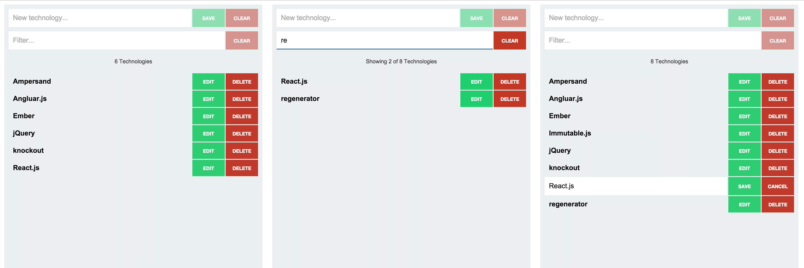

# React.js example

This is a demo repository used to teach how to build apps with react & flux.



## Initial installation

```
$ npm install
$ npm install -g jspm
$ jspm install
```

## Start JSON Server

```
$ npm run api
```

## Start dev server

```
$ npm start
```

